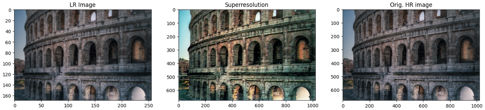

# Super-Resolution-GAN

## Final project for AI CS362 course.

1. Description

Image Super-Resolution is a machine learning process used to make images
clearer and more detailed by increasing their resolution. The aim is to keep
the original content and details intact. The outcome is a sharper version
of the original image. The main goal of this project was to delve into the application of GANs 
for this task, and as a result implement working solution based on the paper https://arxiv.org/pdf/1609.04802v5.

2. Dataset

DIV2K-x2 dataset (https://data.vision.ee.ethz.ch/cvl/DIV2K/).

4. Training process

* Model was trained on Kaggle with GPU P100

* Generator warmup: 150 epoch with lr = 1e-4

* Training: 11250 update itereations with lr = 1e-4

6. Results

   

